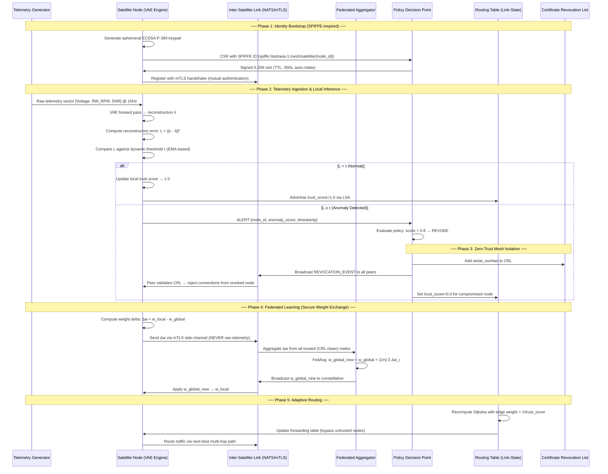

# Astraea-1 Protocol — Architecture Document

## Reference Standards
- **NIST SP 800-207**: Zero Trust Architecture
- **CCSDS 350.0-G-3**: Space Data Link Security Protocol
- **SPIFFE/SPIRE**: Secure Production Identity Framework for Everyone

## Unified System Lifecycle — UML Sequence Diagram



## Component Interaction Overview

```
┌─────────────────────────────────────────────────────────────────────┐
│                    ASTRAEA-1 CONSTELLATION MESH                     │
│                                                                     │
│  ┌──────────┐   mTLS/NATS    ┌──────────┐   mTLS/NATS             │
│  │  SAT-01  │◄──────────────►│  SAT-02  │◄──────────┐             │
│  │  (Node)  │                │  (Node)  │           │             │
│  └────┬─────┘                └────┬─────┘           │             │
│       │                           │                  │             │
│       │ mTLS/NATS                 │ mTLS/NATS       │             │
│       │                           │                  │             │
│  ┌────▼─────┐                ┌────▼─────┐    ┌──────▼───┐        │
│  │  SAT-03  │◄──────────────►│  SAT-04  │◄──►│  SAT-05  │        │
│  │  (Node)  │   mTLS/NATS   │  (Node)  │    │ (Aggreg) │        │
│  └──────────┘                └──────────┘    └──────────┘        │
│                                                                     │
│  Each Node Contains:                                                │
│  ┌─────────────────────────────────────────────────────┐           │
│  │  ┌─────────┐  ┌──────────┐  ┌───────┐  ┌────────┐ │           │
│  │  │   VAE   │  │  mTLS    │  │ Route │  │  PDP   │ │           │
│  │  │ Engine  │  │ Identity │  │ Table │  │ Engine │ │           │
│  │  └────┬────┘  └────┬─────┘  └───┬───┘  └───┬────┘ │           │
│  │       └─────────────┴────────────┴──────────┘      │           │
│  │                  Message Bus (NATS)                  │           │
│  └─────────────────────────────────────────────────────┘           │
└─────────────────────────────────────────────────────────────────────┘
```

## Trust Score Computation

```
trust_score(node_i) = max(0, 1.0 - α * anomaly_score(node_i))

Where:
  α = sensitivity coefficient (default 1.25)
  anomaly_score = normalized VAE reconstruction error
  trust_score ∈ [0.0, 1.0]

Routing edge weight: w(i,j) = base_latency / trust_score(j)
  If trust_score(j) = 0 → w(i,j) = ∞ (link severed)
```
